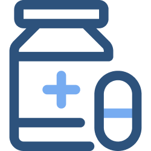

# Segundo Desafío Práctica - DSM

## Presentado por:
- José Samuel Mena Reyes MR171621
- Alejandro Javier González Loarca GL202882

*Ambos del grupo de laboratorio G03L*

---
### Enlace al documento PDF
Enlace al documento solicitado [aquí](https://docs.google.com/document/d/1HP9cg6yGqJEwH_B5uBN4dziZRYFybmQ3PFCY_YpYRck/edit?usp=sharing)

### Enlace a los mockups
Hecho en [Figma](https://figma.com) enlace a los mockups [aquí](https://www.figma.com/file/uMgapJLX5NDl04gT6oNwHB/DSM-T2?node-id=1%3A8)

---

## Icono y nombre de la Aplicación
**Nombre: *MedPharmacy***

**Logo:**

![Logo de MedPharmacy][./docs/logo.png]

